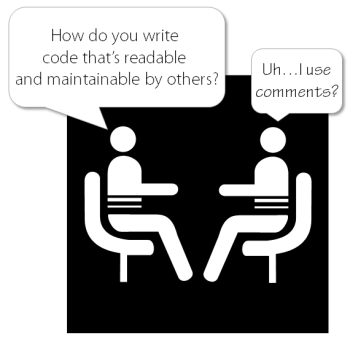

# Clean Code and Architecture Guidelines

Please note, the following sections concentrate on the most important aspects. There are many great books and articles on the web covering each and every detail of clean code and architecture, e.g. (just a small selection):

- Clean Code - Robert C. Martin
- Patterns of Enterprise Application Architecture - Martin Fowler
- Applying Domain-Driven Design and Patterns - Martin Fowler, Eric Evans
- [Clean Code Cheat Sheet](http://www.planetgeek.ch/wp-content/uploads/2013/06/Clean-Code-V2.2.pdf)

## Self-Describing Code

Code should always be written, as if it's going open source. Imagine a developer from outside this company is trying to comprehend a component you coded. Will he be able to understand it easily?

### Comments



Of course using comments is not bad in general, but if that's all you can say about writing clean and readable code, you should definitely reconsider the quality of the code you produce. Continuously strive to write self-documenting code, so the is expressive enough for everyone else to read and understand your code quickly.

Expressiveness of the code means that it has meaningful names. These names should express their intention. They should not mislead you. They should be distinctive. Expressiveness makes code document itself making the need for documentation less important.

So WHAT you do should be self-explaining. WHY you do something or HOW your component should be used on the other hand can be tricky. Consider the following code:

```cs
try
{
	if (HttpContext.Current == null || HttpContext.Current.Request == null)
		return;
}
catch (HttpException)
{
    return;
}
```

`HttpContext` is static a .NET class, which provides HTTP-specific information of a HTTP request. At the first glance, the try-catch seems redundant as all possibilities have been checked. During startup however this class would still throw an `HttpException` and the try-catch is the only way to solve this problem. So in this case a comment would be extremely helpful for others to know why you have to code it that way.

If you want to know more about good and bad comments, Robert C. Martin dedicated a whole chapter in his book Clean Code to this topic.

### Abbreviations

Abbreviations and acronyms can be a readability nightmare. Be especially cautious about terms, which were coined within this company or even within a team. Code will be a lot easier to read and understand when you use whole words.

Of course it's OK to use widely spread abbreviations like XML, HTTP or URL. These terms are known to everybody within our industry. There is no danger using them.

### Magic Numbers

Avoid magic numbers (e.g. 2140, the company number for small and medium business). Instead use constants and enums to give them meaningful names.

### Code Density

Take a look at the following snippet:

```cs
return GetAccounts(DetermineLocationCode(location ?? new CultureInfo("en-US")), getCompanyAccounts
  ? DetermineCompanyCode(userId) : null, GetBlacklistedAccountIds());
```

What's happening here is no rocket science, the code itself is actually quite easy. However the nested method calls combined with conditional statements makes it hard to read. Readability suffers even more due to arbitrary linebreaks.

By extracting the calls, the code is a lot easier to comprehend and additional linebreaks become dispensable:

```cs
var defaultCulture = new CultureInfo("en-US");
string locationCode = DetermineLocationCode(location ?? defaultCulture);
int? companyCode = getCompanyAccounts ? DetermineCompanyCode(userId) : null;
var blacklistedAccountIds = GetBlacklistedAccountIds();

return GetAccounts(locationCode, companyCode, blacklistedAccountIds);
```

## Classes

**Do one thing and do it well.** This mantra of single responsibility sums it up pretty well. Figure out, what this one thing is. Anything else must be developed in other components. Always use **Dependency Injection (DI)** and **Inversion of Control (IoC)** to separate construction from use.

**Size:** It's hard to define a strict rule for how big a class should be. But as a rule of thumb: A well designed class should get along with less than 250 lines of code. If your class exceeds 500 lines of code, seriously reconsider, if it's really just doing one thing and one thing only. If it exceeds 1000 lines of code, there's definitely something wrong.

**Partial Classes:** Partials don't reduce the complexity of a class. If you feel the need to spread a class over several files, there is no reason not to split it up into separate classes right away.

## Methods

**Size:** If you need several minutes (or even more) to grasp what's going on inside of a method, it's not designed well and probably carries more than one responsibility. An ideal method can be captured at a glance and it can be comprehended within seconds (less than a minute). As a rule of thumb, it should not exceed 50 lines of code.

**Signature:** Many parameters *can* be an indication, that a method is doing too much and should be split up. If many parameters are really needed (for whatever reason), you should consider to put the parameters in a separate class, that serves as a DTO customized for that method. But please don't create parameter DTOs for each and every method upfront. These DTO are only worth the effort for methods with complex signatures and/or signatures that change a lot over time.

## Unit Tests

A clean coded component can be unit tested completely and easily writing just a couple of simple tests. When you have to write bloated and complicated tests, your code most likely breaks one or more laws of clean code. Design your code, so it can be tested in isolation, free from any other distracting variables. A lack of dependency injection and breaking the rule of single responsibility are the most common culprits.

The **AAA** (Arrange, Act, Assert) pattern is a common way of writing unit tests.
- The Arrange section of a unit test method initializes objects and sets the value of the data that is passed to the method under test.
- The Act section invokes the method under test with the arranged parameters.
- The Assert section verifies that the action of the method under test behaves as expected.

Here's an example of a well coded test:

```cs
[TestMethod]
public void DistinctBy_ShouldOnlyReturnOneInstanceWithId()
{
    // Arrange
    List<TestData> items = new List<TestData> { new TestData(1, "A"), new TestData(1, "A") };

    // Act
    IEnumerable<TestData> result = items.DistinctBy(x => x.Id);

    // Assert
    result.Should().HaveCount(1);
}
```

The test is extremely easy to comprehend, as it's small, simple, structured and what's most important, it only tests one aspect of the a component.

## Encapsulation and Information Hiding

Encapsulation and information hiding are two core principles of object oriented programming and lead to a couple of benefits:

- Simplifies the code
- Reduces complexity
- Limits dependencies in code
- Improves code readability

Unfortunately many coders only adopt these principles for the properties and methods within a class. But of course it must also be applied to the classes themselves. Every component, that is only used within a project, must not be visible to the outside world. Encapsulation is a powerful tool. Learn it. Practice it. Apply it to your code, correctly.
