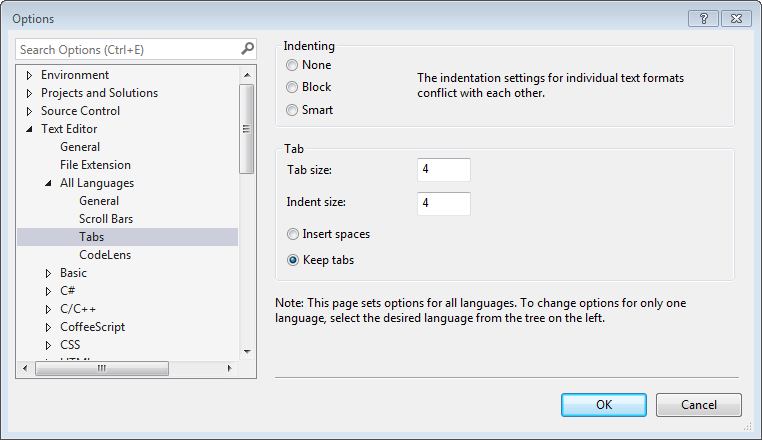
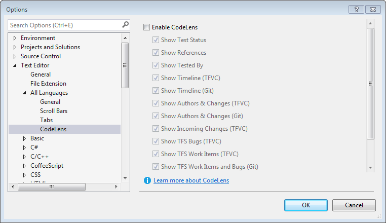
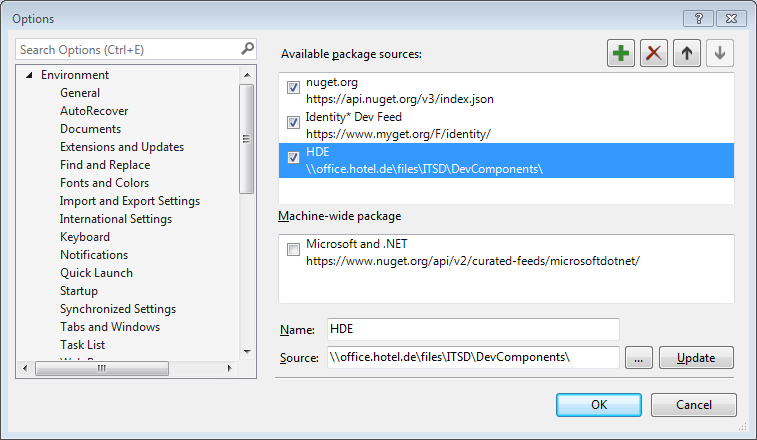
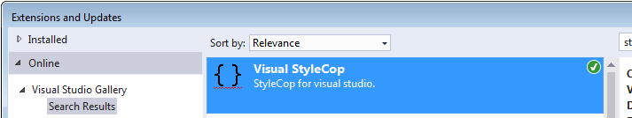
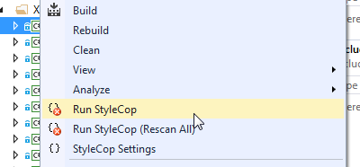
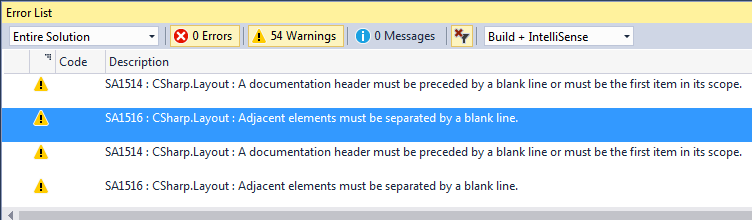

# Dev Tools

## Visual Studio Configuration

There is only one small setting for Visual Studio that is mandatory for all developers. Nevertheless it's a controversially discussed topic, that lead to countless wars of religion between developers. Historically our code is developed using tabs. So regardless of the pros and cons of tabs vs. spaces, to keep the code consistent, the according configuration in VS must be set to tabs for all languages:



**Note:** If you encounter performance issues (especially in large projects), try to disable CodeLens.



## ReSharper

ReSharper is without doubt the best productivity tool for C#/.NET developers. When used diligently it will boost the development speed and the quality of code extremely. So, explore its features and use them.

Always install the latest version of [ReSharper](https://www.jetbrains.com). The license server should be detected automatically. If not use the following URL: http://tsn-kms-02:8080/licenseServer

**Hint:**
ReSharper is collection tons of data within its caches for each solution. Especially for large solutions these caches can grow very big over time and the VS becomes slower (sometimes even unresponsive) and sometimes even buggy. So when this happens, you should try to delete the caches:  %USERPROFILE%\\AppData\\Local\\JetBrains\\Transient

## NuGet

All external libraries must be installed via NuGet. Direct assembly references must be an exception and are only allowed, if there's NuGet package available.

To access our internally developed packages, configure the according [share](\\office.hotel.de\files\ITSD\DevComponents\) in Visual Studio:



This share must also be configured within the NuGet config file of each application, otherwise will fail, because the internal packages cannot be found:
```xml
<?xml version="1.0" encoding="utf-8"?>
<configuration>
  <solution>
    <add key="disableSourceControlIntegration" value="true" />
  </solution>
  <config>
  	<add key="repositoryPath" value="..\..\..\Packages" />
  </config>
  <activePackageSource>
  	<add key="All" value="(Aggregate source)" />
  </activePackageSource>
  <packageSources>
    <add key="HDE" value="\\office.hotel.de\files\ITSD\DevComponents" />
    <add key="nuget.org" value="https://www.nuget.org/api/v2/" />
  </packageSources>
</configuration>
```

If you wonder, how to create your own NuGet package, just read [this how-to](../howtos/CreateNugetPackages.md).

## StyleCop

StyleCop (SC) analyzes C# source code to enforce a set of style and consistency rules. It can be run from inside of Visual Studio or integrated into an MSBuild project.

For all new projects (including new projects in THOR) SC has to be integrated. It's highly advised to use SC from the beginning of a project. Otherwise you most probably will be flooded with style errors.

### Rules

Not all rules are suitable for our purposes. For example SC by default demands for each file to have a file header. This can be very important when you need to include a copyright text, but it's definitely not something we need. For further documentation of our style and naming rules please refer to [Conventions](Conventions.md). You can find our adjusted SC settings file within the [Architecture](https://hdetfs.visualstudio.com/DefaultCollection/_git/Arc) repository (/StyleCop/Settings.StyleCop).

By default all SC rules are enabled. In order to use our adjusted rule set place the settings file in the root directory of the according application and it will automatically apply to all projects beneath that directory.

### Installation

To use SC outside of Visual Studio, you can install the application from the [StyleCop website](https://stylecop.codeplex.com/). Essential however is the Visual Studio extension:



As soon as it's installed, you should be able to see the StyleCop commands in the context menu of a project:



When you run it, the code of the project will be validated and rule violations will appear in the Error List window (Build + IntelliSense must be selected):



### MSBuild Integration

We want SC not just to check our code, when we tell run it explicitly, but every time when we build our project. This can be achieved by adding the following NuGet package to each project: **StyleCop.MSBuild**

By default SC will treat rule violations as warnings, which is thing good during development, as you don't want your build to fail only because of some styling rules. But when you finished working and push your changes to the main branch, these warnings must become errors, that lead to a failed build and keep you from checking in unclean code to the main line. In order to activate the error behavior, you simply add `StyleCopTreatErrorsAsWarnings=false` to the MSBuild arguments.

## GIT

TODO:
- explain GIT Setup/Config
- document ignore files
- Daily Builds / Continuous Integration
- explain configuration of the builds
